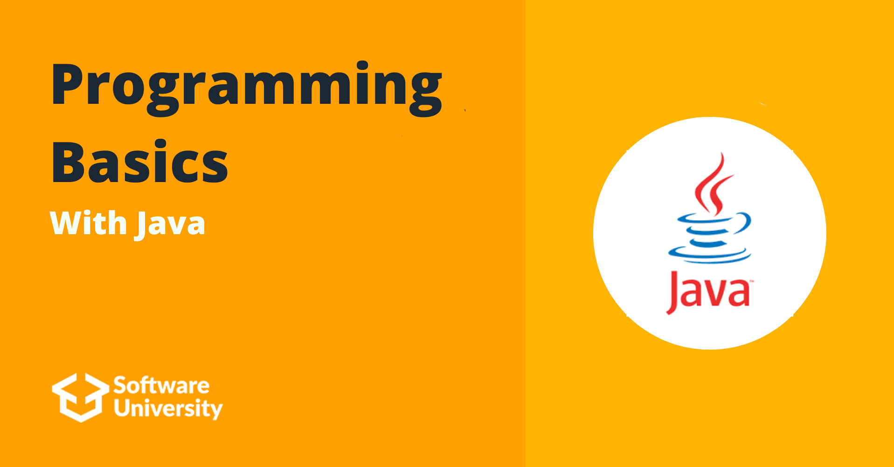

# Programming Basics With Java July 2023

## Intro
The Programming Basics was my first touch with programming. In this course I wrote my first program ("Hello World"), learned the most basic things like if-else statements, for and while loops.

To learn more about the course you can check [Softuni](https://softuni.bg/)

## Course topics

### First Steps In Coding
- [Lab](https://github.com/Dimitar-Peev/01.PB-Java-July-2023/tree/main/_01_FirstStepsInCoding/_01_Lab)
- [Exercise](https://github.com/Dimitar-Peev/01.PB-Java-July-2023/tree/main/_01_FirstStepsInCoding/_02_Exercise)
- [More Exercise](https://github.com/Dimitar-Peev/01.PB-Java-July-2023/tree/main/_01_FirstStepsInCoding/_03_MoreExercises)
### Conditional Statements
- [Lab](https://github.com/Dimitar-Peev/01.PB-Java-July-2023/tree/main/_02_ConditionalStatements/_01_Lab)
- [Exercise](https://github.com/Dimitar-Peev/01.PB-Java-July-2023/tree/main/_02_ConditionalStatements/_02_Exercise)
- [More Exercise](https://github.com/Dimitar-Peev/01.PB-Java-July-2023/tree/main/_02_ConditionalStatements/_03_MoreExercises)
### Conditional Statements Advanced
- [Lab](https://github.com/Dimitar-Peev/01.PB-Java-July-2023/tree/main/_03_ConditionalStatementsAdvanced/_01_Lab)
- [Exercise](https://github.com/Dimitar-Peev/01.PB-Java-July-2023/tree/main/_03_ConditionalStatementsAdvanced/_02_Exercise)
- [More Exercise](https://github.com/Dimitar-Peev/01.PB-Java-July-2023/tree/main/_03_ConditionalStatementsAdvanced/_03_MoreExercises)
### For Loop
- [Lab](https://github.com/Dimitar-Peev/01.PB-Java-July-2023/tree/main/_04_ForLoop/_01_Lab)
- [Exercise](https://github.com/Dimitar-Peev/01.PB-Java-July-2023/tree/main/_04_ForLoop/_02_Exercise)
- [More Exercise](https://github.com/Dimitar-Peev/01.PB-Java-July-2023/tree/main/_04_ForLoop/_03_MoreExercises)
### While Loop 
- [Lab](https://github.com/Dimitar-Peev/01.PB-Java-July-2023/tree/main/_05_WhileLoop/_01_Lab)
- [Exercise](https://github.com/Dimitar-Peev/01.PB-Java-July-2023/tree/main/_05_WhileLoop/_02_Exercise)
- [More Exercise](https://github.com/Dimitar-Peev/01.PB-Java-July-2023/tree/main/_05_WhileLoop/_03_MoreExercises)
### Nested Loops
- [Lab](https://github.com/Dimitar-Peev/01.PB-Java-July-2023/tree/main/_06_NestedLoops/_01_Lab)
- [Exercise](https://github.com/Dimitar-Peev/01.PB-Java-July-2023/tree/main/_06_NestedLoops/_02_Exercise)
- [More Exercise](https://github.com/Dimitar-Peev/01.PB-Java-July-2023/tree/main/_06_NestedLoops/_03_MoreExercises)

## Exams
- [Programming Basics Online Exam - 9 And 10 March 2019](https://github.com/Dimitar-Peev/01.PB-Java-July-2023/tree/main/_08_ProgrammingBasicsExams/PB_Online_Exam_9_and_10_March_2019)
- [Programming Basics Online Exam - 6 And 7 April 2019](https://github.com/Dimitar-Peev/01.PB-Java-July-2023/tree/main/_08_ProgrammingBasicsExams/PB_Online_Exam_6_and_7_April_2019)
- [Programming Basics Online Exam - 20 And 21 April 2019](https://github.com/Dimitar-Peev/01.PB-Java-July-2023/tree/main/_08_ProgrammingBasicsExams/PB_Online_Exam_20_and_21_April_2019)
- [Programming Basics Retake Online Exam - 2 And 3 May 2019](https://github.com/Dimitar-Peev/01.PB-Java-July-2023/tree/main/_08_ProgrammingBasicsExams/PB_Online_Retake_Exam_2_and_3_May_2019)
- [Programming Basics Online Exam - 15 And 16 June 2019](https://github.com/Dimitar-Peev/01.PB-Java-July-2023/tree/main/_08_ProgrammingBasicsExams/PB_Online_Exam_15_and_16_June_2019)
- [Programming Basics Online Exam - 6 And 7 July 2019](https://github.com/Dimitar-Peev/01.PB-Java-July-2023/tree/main/_08_ProgrammingBasicsExams/PB_Online_Exam_6_and_7_July_2019)
- [Programming Basics Online Exam - 28 And 29 March 2020](https://github.com/Dimitar-Peev/01.PB-Java-July-2023/tree/main/_08_ProgrammingBasicsExams/PB_Online_Exam_28_and_29_March_2020)
- [Programming Basics Online Exam - 18 And 19 July 2020](https://github.com/Dimitar-Peev/01.PB-Java-July-2023/tree/main/_08_ProgrammingBasicsExams/PB_Online_Exam_18_and_19_July_2020)

## Certificates
[Programming Basics Certificate](https://softuni.bg/certificates/details/182553/ca9a0a1d)
